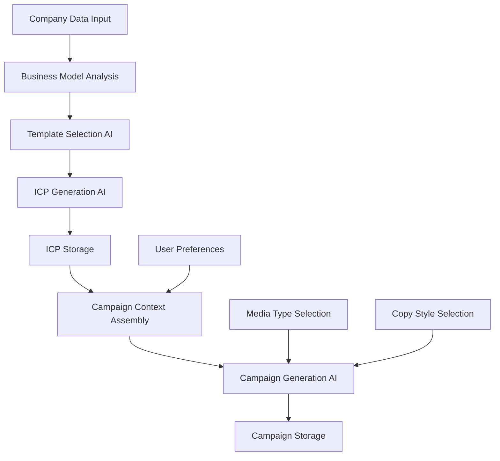

# AI Workflow Documentation

## 🤖 AI System Overview

ICP Builder leverages a sophisticated AI workflow that combines Ideal Customer Profile (ICP) generation with marketing campaign creation. The system uses a local Ollama LLM (llama3.2:3b-instruct-q4_K_M) to provide comprehensive, privacy-focused AI processing without external API dependencies.

## 🧠 Core AI Components

### 1. AISDKService (`src/services/ai/ai-sdk-service.ts`)

The foundational AI service that manages all LLM communication.

**Key Features:**
- **Singleton Pattern**: Single instance shared across the application
- **Vercel AI SDK Integration**: Modern AI SDK with Ollama provider
- **Local Processing**: All AI processing happens locally - no external APIs
- **Error Recovery**: Robust error handling and retry mechanisms
- **Performance Optimized**: Efficient model loading and response handling

**Technical Implementation:**
```typescript
class AISDKService {
  private static instance: AISDKService;
  private ollama: Ollama;
  
  async generateText(prompt: string, systemPrompt?: string): Promise<string> {
    // Handles LLM communication with error recovery
  }
}
```

### 2. ICP Generator (`src/services/ai/icp/generator/icp-builder.ts`)

Orchestrates the complete ICP generation workflow with intelligent template selection.

**Workflow Process:**

#### Phase 1: Business Model Analysis
```typescript
analyzeBusinessModel(companyData) {
  // Analyzes company data to determine:
  // - Business type (B2B, B2C, B2B2C)
  // - Industry classification
  // - Market positioning
  // - Target audience hints
}
```

#### Phase 2: Template Selection
```typescript
selectTemplates(companyData) {
  // AI-driven selection from 140+ templates based on:
  // 1. Business model compatibility
  // 2. Industry relevance
  // 3. Company size alignment
  // 4. Market maturity
  // 5. Value proposition match
  // 6. Target audience signals
}
```

#### Phase 3: Single-Call Generation
```typescript
generateICP(template, companyData) {
  // One comprehensive LLM call generates:
  // - Customer segments and demographics
  // - Pain points and challenges
  // - Jobs to be done
  // - Desired outcomes
  // - Buying triggers and decision factors
  // - Common objections
  // - Value proposition alignment
  // - Go-to-market strategies
  // - Content and messaging ideas
  // - Fit scoring (0-100) with ABM tiering
}
```

**Efficiency Benefits:**
- **Speed**: 30-60 seconds per ICP (vs 2-3 minutes with multi-call approach)
- **Consistency**: Coherent profiles from single context
- **Reliability**: Simpler parsing with fewer failure points
- **Cost**: Reduced computational overhead

### 3. Campaign Generator (`src/services/ai/campaign-generator.ts`)

Creates comprehensive marketing campaigns tailored to specific ICPs and company contexts.

**Campaign Generation Process:**

#### Phase 1: Context Assembly
```typescript
getICPData(icpId) {
  // Retrieves complete ICP profile:
  // - Target audience details
  // - Pain points and motivations
  // - Communication preferences
  // - Decision-making factors
}

getCompanyData(icpId) {
  // Fetches company context:
  // - Value proposition
  // - Unique features
  // - Competitive advantages
  // - Industry positioning
}
```

#### Phase 2: Campaign Generation
```typescript
generateCampaign({
  icpData,
  companyData,
  copyStyle,
  mediaType,
  imagePrompt,
  campaignDetails
}) {
  // Single AI call generates:
  // - Platform-specific ad copy
  // - Compelling calls-to-action
  // - Landing page hooks (5 variations)
  // - Persuasive landing page copy
  // - AI-optimized image suggestions
}
```

**Campaign Types Supported:**
- **Google Ads**: Search and display advertising
- **LinkedIn**: Professional social media campaigns
- **Email**: Direct marketing campaigns
- **Print**: Traditional media advertising
- **Social Media**: Multi-platform social campaigns

**Copy Styles Available:**
- **Facts**: Data-driven, analytical approach
- **Humour**: Engaging, memorable messaging
- **Smart**: Intelligent, sophisticated tone
- **Emotional**: Emotional connection focus
- **Professional**: Business-oriented communication

## 🔄 AI Workflow Architecture

### Data Flow Diagram



### Processing Pipeline

1. **Input Validation**
   - Company data completeness check
   - Business context validation
   - User preference validation

2. **AI Processing**
   - Context-aware prompt construction
   - Intelligent model selection
   - Response parsing and validation

3. **Output Assembly**
   - Structured data creation
   - Quality assurance checks
   - Database persistence

4. **Error Recovery**
   - Fallback value provision
   - Partial result handling
   - User notification system

## 📋 Template Library System

### Template Categories

#### B2B Templates (70 variations)
- **Startup Companies**: Early-stage, growth-focused businesses
- **SMB**: Small to medium businesses with specific needs
- **Mid-Market**: Established companies with complex requirements
- **Enterprise**: Large organizations with sophisticated demands
- **Industry-Specific**: Tailored for specific sectors

#### B2C Templates (70 variations)
- **Demographics**: Age, income, location-based segments
- **Lifestyle**: Interest and behavior-based profiles
- **Behavioral**: Purchase pattern and usage-based
- **Specialized**: Niche market segments

#### B2B2C Templates (25 variations)
- **Platform Partners**: Marketplace and ecosystem participants
- **Hybrid Businesses**: Mixed business model companies

### Template Selection Algorithm

```typescript
interface TemplateSelection {
  businessModelScore: number;     // 0-100
  industryRelevance: number;      // 0-100
  companySizeAlignment: number;   // 0-100
  marketMaturity: number;         // 0-100
  valuePropositionMatch: number;  // 0-100
  audienceSignals: number;        // 0-100
  totalScore: number;             // Weighted average
}
```

## 🎯 AI Prompt Engineering

### ICP Generation Prompts

**System Prompt Strategy:**
- Clear role definition for the AI
- Specific output format requirements
- Context preservation instructions
- Error handling guidelines

**User Prompt Construction:**
- Company context integration
- Template-specific guidance
- Output structure specification
- Quality criteria definition

### Campaign Generation Prompts

**Context-Aware Prompting:**
- ICP-specific audience insights
- Company value proposition integration
- Media-specific requirements
- Style-appropriate tone guidance

**Output Optimization:**
- Platform-specific formatting
- Character limit considerations
- CTA effectiveness optimization
- Conversion-focused messaging

## 🔧 Technical Implementation

### Error Handling Strategy

```typescript
interface AIErrorHandling {
  parseErrors: {
    fallbackValues: boolean;
    partialResults: boolean;
    userNotification: boolean;
  };
  networkErrors: {
    retryMechanism: boolean;
    timeoutHandling: boolean;
    offlineSupport: boolean;
  };
  modelErrors: {
    alternativePrompts: boolean;
    degradedMode: boolean;
    errorLogging: boolean;
  };
}
```

### Performance Optimization

**Response Caching:**
- Redis-based result caching
- Context-aware cache keys
- TTL-based invalidation
- Cache warming strategies

**Prompt Optimization:**
- Minimal token usage
- Context compression
- Relevant information prioritization
- Response format efficiency

### Quality Assurance

**Content Validation:**
- Business logic validation
- Completeness verification
- Consistency checks
- Output sanitization

**AI Response Monitoring:**
- Response time tracking
- Success rate monitoring
- Quality metrics collection
- Continuous improvement feedback

## 📊 AI Performance Metrics

### Generation Speed
- **ICP Generation**: 30-60 seconds per profile
- **Campaign Generation**: 15-30 seconds per campaign
- **Template Selection**: 5-10 seconds per analysis

### Quality Metrics
- **ICP Completeness**: 95%+ field completion rate
- **Campaign Relevance**: High context alignment
- **Template Accuracy**: 90%+ appropriate selection

### System Performance
- **Model Loading**: < 5 seconds initial load
- **Memory Usage**: ~2GB for model + processing
- **Concurrent Processing**: 1-3 simultaneous generations

## 🚀 Future AI Enhancements

### Planned Improvements

1. **Advanced Template Learning**
   - Dynamic template creation
   - User feedback integration
   - Performance-based optimization

2. **Multi-Modal AI Integration**
   - Image generation for campaigns
   - Video content suggestions
   - Audio script creation

3. **Real-Time Optimization**
   - Campaign performance feedback
   - A/B testing integration
   - Conversion optimization

4. **Enhanced Personalization**
   - User behavior learning
   - Industry-specific improvements
   - Regional adaptation

## 🔒 AI Privacy & Security

### Local Processing Benefits
- **No Data Transmission**: All processing happens locally
- **Privacy Compliance**: GDPR/CCPA compliant by design
- **Data Control**: Complete control over sensitive information
- **Security**: No external API key dependencies

### Data Handling
- **Temporary Processing**: No permanent AI service data retention
- **Structured Output**: Predictable, sanitized responses
- **Input Validation**: Comprehensive input sanitization
- **Output Filtering**: Content appropriateness validation

## 📖 Development Guidelines

### AI Service Development
1. **Single Responsibility**: Each AI service has one clear purpose
2. **Error Resilience**: Comprehensive error handling and recovery
3. **Performance Focus**: Optimized for speed and efficiency
4. **Maintainability**: Clear interfaces and documentation

### Prompt Engineering Best Practices
1. **Clarity**: Clear, unambiguous instructions
2. **Context**: Appropriate context provision
3. **Constraints**: Specific output format requirements
4. **Testing**: Extensive prompt testing and validation

### Integration Patterns
1. **Service Layer**: AI services separate from UI components
2. **State Management**: Centralized AI state in useAppState
3. **Error Boundaries**: React error boundaries for AI failures
4. **Loading States**: Clear user feedback during processing

---

This AI workflow documentation provides a comprehensive overview of how artificial intelligence is integrated throughout the ICP Builder system, from initial profile generation to complete marketing campaign creation, all while maintaining privacy and performance through local processing.
